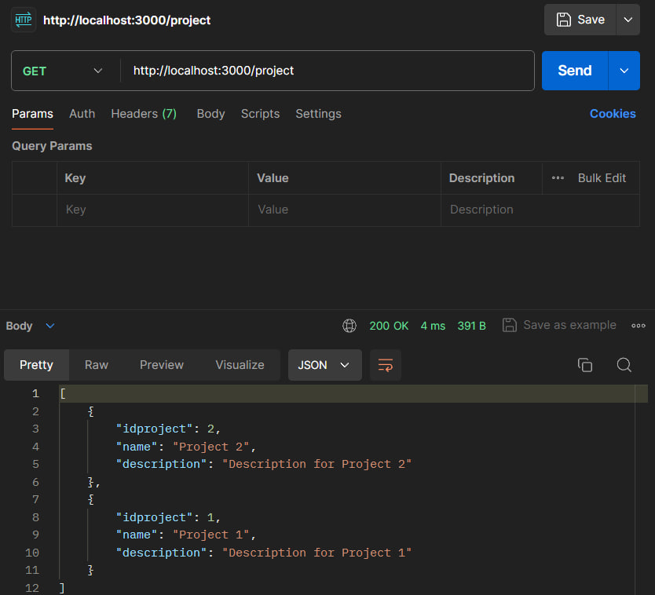
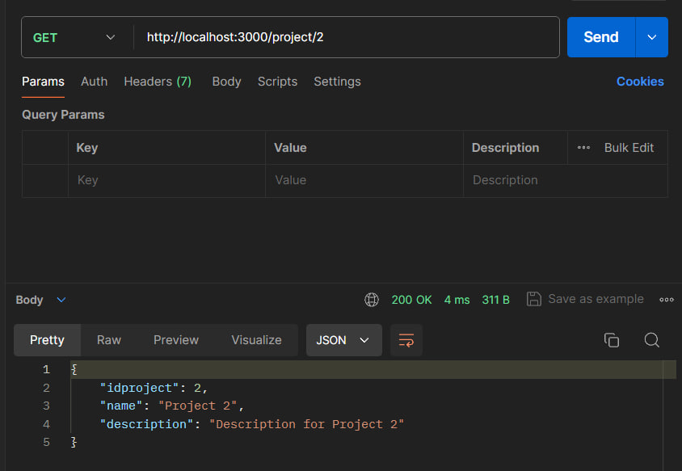
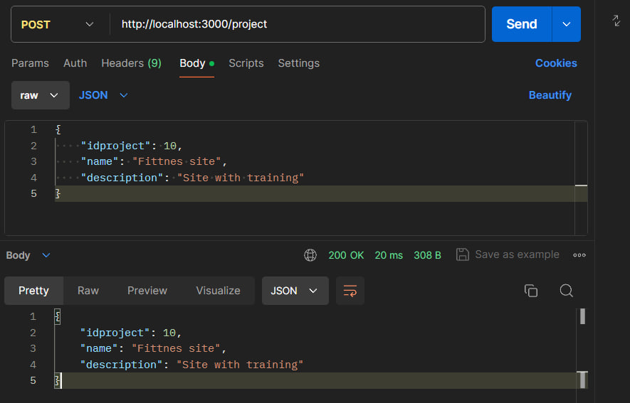
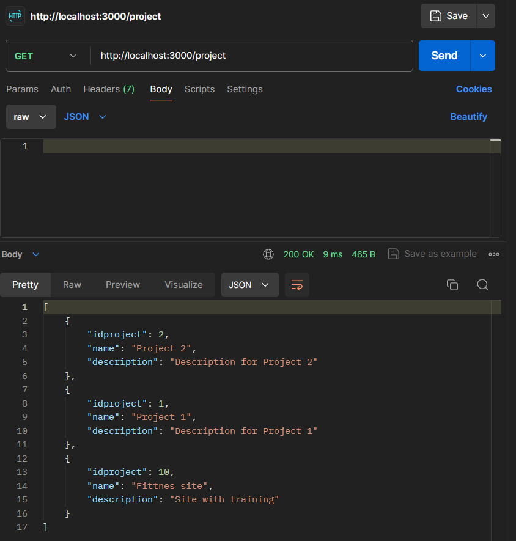
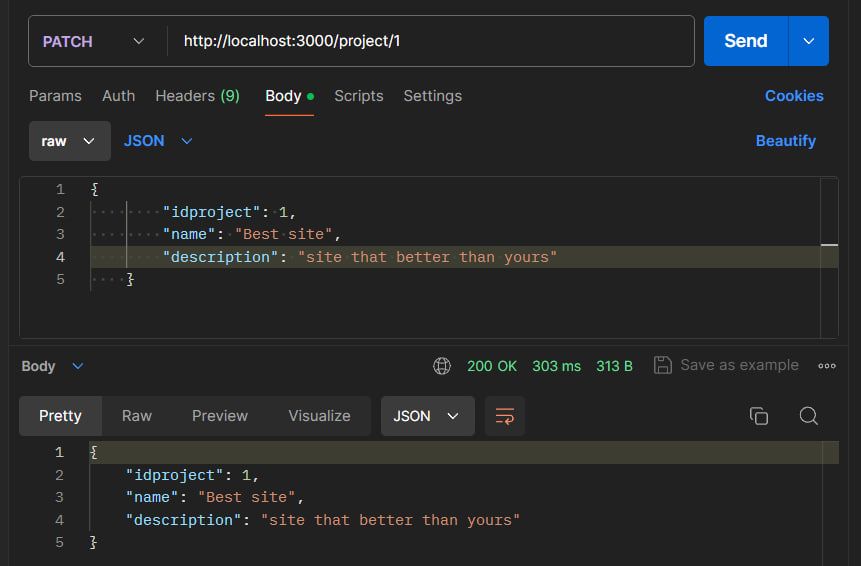
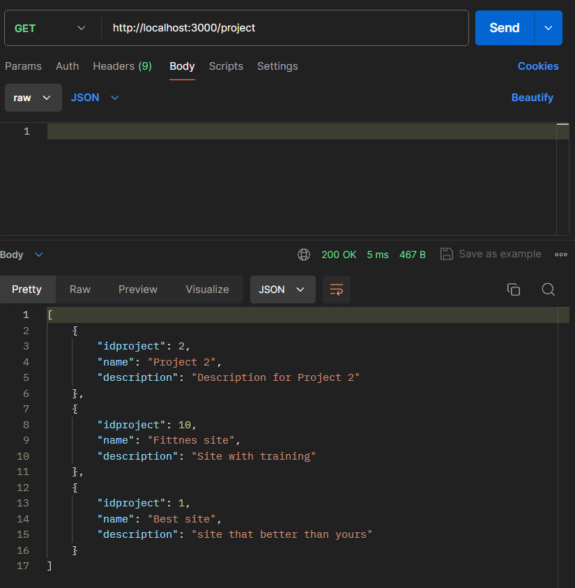
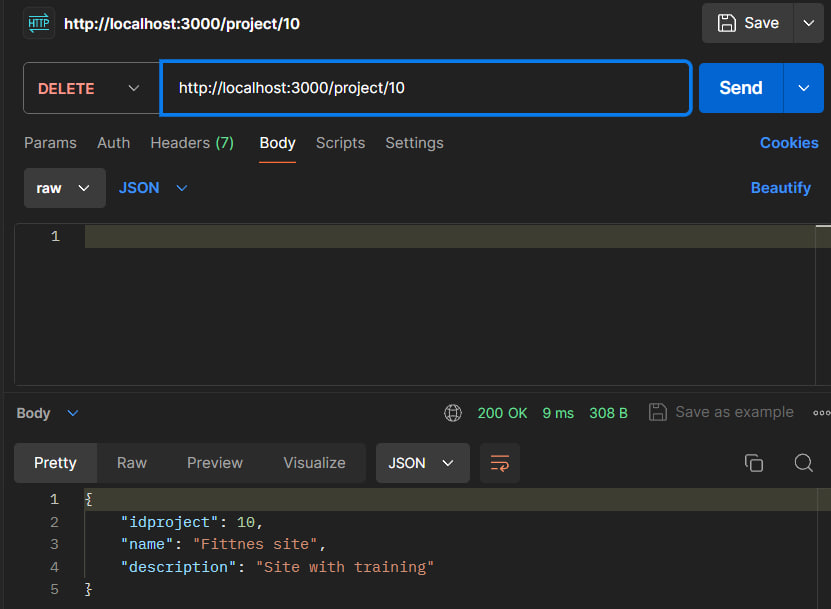
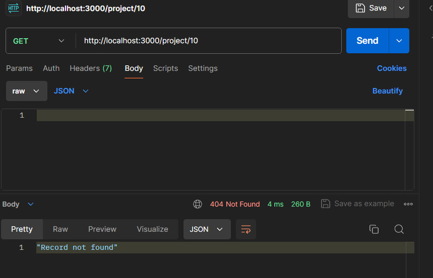

# Тестування працездатності системи

_В цьому розділі необхідно вказати засоби тестування, навести вихідні коди тестів та результати тестування._

## Метод GET

## GET ALL

### Отримання всіх даних

## GET BY ID

### Отримання даних за вказаним ID

## Метод POST

### Надсилання запиту

### Перевірка запиту через метод GET

## Метод PATCH

### Надсилання запиту

### Перевірка запиту через метод GET

## Метод DELETE

### Надсилання запиту

### Перевірка запиту через метод GET ID

